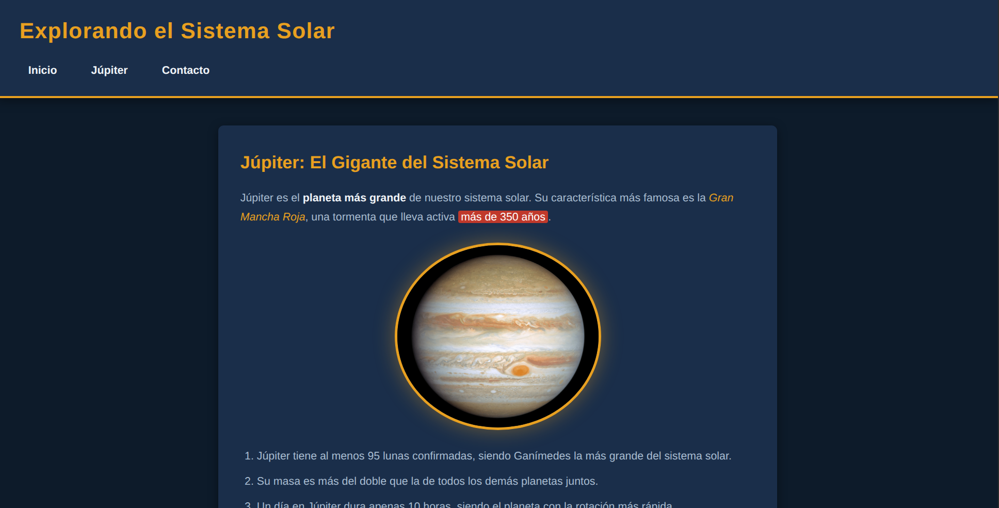

# tarea-1-utn-fullstack

# 🌌 El Sistema Solar — Mi primera página web semántica

**Curso:** Antes de React — Centro de e-Learning UTN BA  
**Módulo:** 1 — Unidad 1  
**Autor:** Facundo Rodriguez

---

## 📸 Captura de pantalla



---

## 📋 Descripción

Página web estática sobre Júpiter y el sistema solar, desarrollada como primera entrega del módulo "Antes de React". Aplica estructura semántica HTML5, estilos con CSS externo, variables CSS, selectores de clase e ID, y un formulario funcional.

---

## 🚀 Cómo clonar y abrir el proyecto

```bash
# 1. Clonar el repositorio
git clone https://github.com/FARO1993/tarea-1-utn-fullstack.git

# 2. Ingresar a la carpeta
cd tarea-1-utn-fullstack

# 3. Abrir el archivo en el navegador
# En Windows:
start index.html
# En Mac:
open index.html
# En Linux:
xdg-open index.html
```

No requiere servidor ni dependencias. Se abre directamente en el navegador.

---

## 📚 Bibliografía y créditos

**Imagen:** Fotografía de Júpiter tomada por la sonda Voyager 1 (NASA/JPL). Dominio público.

**Referencias:**
- Duckett, J. *HTML & CSS: Design and Build Websites*. 1ª ed. John Wiley & Sons, 2011.
- Keith, J. *HTML5 for Web Designers*. 2ª ed. A Book Apart, 2010.
- MDN Web Docs. *HTML: HyperText Markup Language*. Mozilla Corporation. https://developer.mozilla.org/en-US/docs/Web/HTML
- MDN Web Docs. *CSS: Cascading Style Sheets*. Mozilla Corporation. https://developer.mozilla.org/en-US/docs/Web/CSS
- WHATWG. *HTML Living Standard* (2025). https://html.spec.whatwg.org/
- Stack Overflow. Comunidad de preguntas y respuestas sobre desarrollo web. https://stackoverflow.com
- Anthropic. Claude (modelo de inteligencia artificial). Utilizado como asistente para la generación y revisión del código HTML y CSS de este proyecto. https://www.anthropic.com